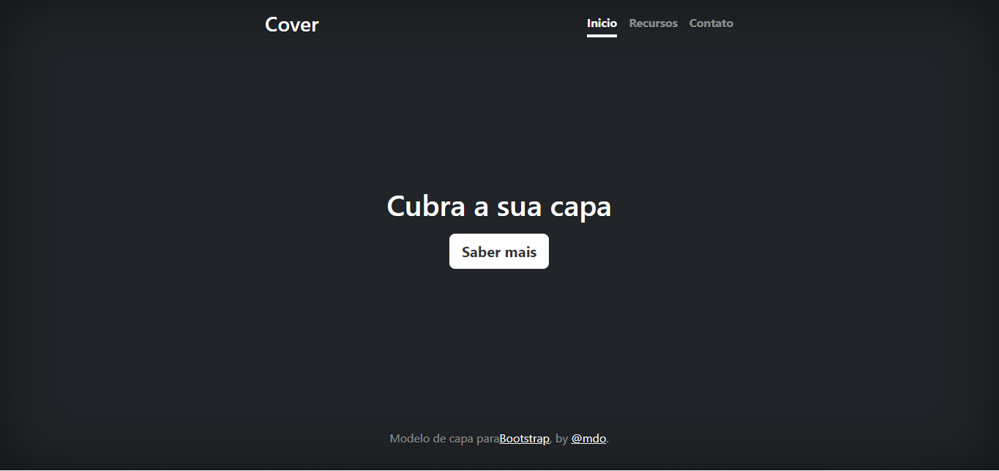

[ Projeto - Apredendo a escrever um README](#projeto---apredendo-a-escrever-um-readme)

[Descriçao](#descri%C3%A7ao)  

[Introduçao](#introdu%C3%A7ao)  

[Funcionalidade](#funcionalidade) 

[Tecnologias-utilizadas](#tecnologias-ultilizadas)  

[Fontes-consultadas](#fontes-consultadas)

[Autores](#autores)  
# Projeto - Apredendo a escrever um README 

## Descriçao

  Este é um modelo de site de capa simples e elegante projetado para criar páginas de capa impressionantes. 

   <h4 align="center"> 
    :construction: 🚧 Projeto em construção 🚧 :construction:</h4>

## Introduçao

Este é um modelo de site de capa simples e elegante projetado para criar páginas de capa impressionantes e envolventes para qualquer tipo de projeto, seja pessoal, profissional ou empresarial. Com este modelo, você pode facilmente criar uma presença on-line cativante para apresentar seu conteúdo de maneira atraente.

## Funcionalidade

- Saber mais: O botão "Saber mais" em um site é um elemento de interface frequentemente utilizado para fornecer aos visitantes do site a oportunidade de obter informações adicionais sobre um determinado tópico, produto, serviço ou seção do site. 
- Inicio: Botao do inicio e ultilizado para se retornar a tela inicial de um site.
- Recursos: Esse botao recursos e usado para se saber sobre mais recursos que um site oferece ao seus usuarios.
- Contato: Nesse botão de contato serve para que o usuário entre em contato com as pessoas responsáveis pelo site, caso o usuário tenha alguma dúvida ou algum problema a ser relato e consertado, caso seja um problema e não uma simples dúvida.

## Tecnologias ultilizadas

## Fontes consultadas

## Autores